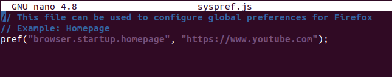
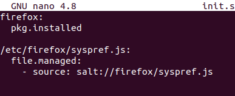

# Harjoitus 5

## a) Asenna 10 suosikkiohjelmaasi saltilla.

selailin internettiä ja löysin [sivun](https://linuxhint.com/100_best_ubuntu_apps/), jossa listattiin 100 kevyttä ohjelmaa, joista päätin valitsin kymmenen.

Valitsin ladattaviksi ohjemlmiksi Gimp, Synaptic, Skype, Qalculate, GnuCash, Converseen, Sublime Text, Dropbox, Filezilla ja speedcrunch

Tein /srv/salt tilan myapps, johon tein init.sls tiedoston, johon tein seuraavan rakenteen.

tila ei toiminut halutulla tavalla.

päätin kokeilla asentaa sovellukset, joita virheilmoituksessa ei mainittu.

tilan ajaminen unnistui ja kun ajoin sen uudelleen niin mitään ei muuttunut.

## b) Lisää Microsoftin pakettivarasto ja asenna Visual Studio Code.

Löysin internetistä [ohjeen](https://ostechnix.com/how-to-add-microsofts-linux-software-repository/) miten saan lisättyä Microsoftin pakettivaraston Linuxiin. Ubuntu 20.04 LTS versiossa pitää laittaa seuraavat komennot.

  curl -sSL https://packages.microsoft.com/keys/microsoft.asc | sudo apt-key add -
  sudo apt-add-repository https://packages.microsoft.com/ubuntu/20.04/prod
  sudo apt update

sen jälkeen asensin VSCoden komennolla.

sudo snap install --classic code

ohjelma toimi.

## c) Säädä jotain ohjelmaa ja etsi sen muuttamat tiedostot aikajanasta. Tee sitten tästä oma Saltin tila.

Valitsin säädettäväksi ohjelmaksi firefox selaimen. Tein tilan, joka asentaa firefoxin ja vaihtaa sen asetuksia. Tein ensin kansion salttiin ja sinne sls tiedoston. Valitsin konfiguroitavaksi asiaksi oletus sivun vaihtamisen.

Testasin aluksi pkg installed, joka toimi hyvin. Lisäsin sen jälkeen file.managed kohdan minun sls tiedostoon. Firefoxin oletussivun konffaustiedoston nimi on syspref.js, johon laitoin seuraavan rivin.

Testasin file.managed funktiuon toimivuutta ja se toimi oikein. Lopullisen sls tiedoston sisältö.

Otin aikajanan etc kansiosta [tehtävänannossa olleella komennolla](https://terokarvinen.com/2021/configuration-management-systems-palvelinten-hallinta-ict4tn022-spring-2021/#h5-aikajana)

Aikajanassa näkyy muuttamani asetustiedostot tehtävän edellistä kohtaa varten. Muuttelin apachen ja firefox selaimen asetuksia ja otin aikajanan uudelleen.

## d) Asenna jokin toinen ohjelma asetuksineen.

-kesken-

## Lähteet

https://ostechnix.com/how-to-add-microsofts-linux-software-repository/

https://terokarvinen.com/2021/configuration-management-systems-palvelinten-hallinta-ict4tn022-spring-2021/#h5-aikajana
